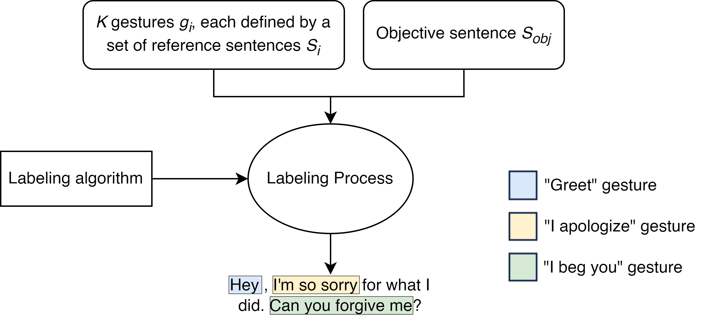
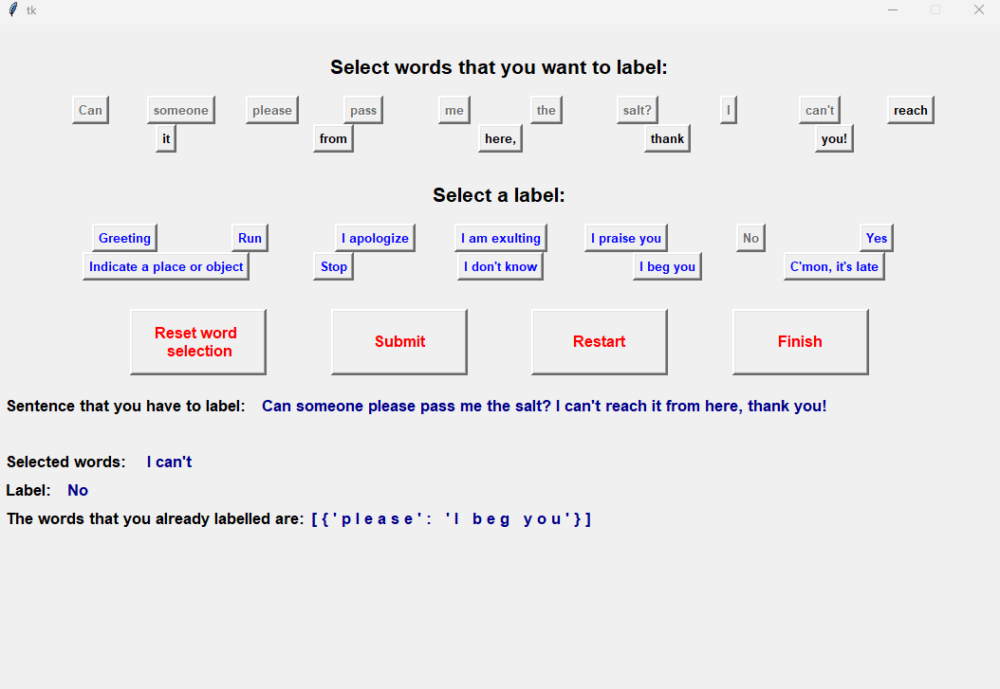

# Gestures Labeling

This repository contains a Jupyter notebook for labeling words in a sentence with
Symbolic and Deictic gestures. It accompanies the paper
["Labeling Sentences with Symbolic and Deictic Gestures via Semantic Similarity"](https://arxiv.org/abs/2407.02151),
published in the 2024 IEEE International Conference on Robot and Human
Interactive Communication (ROMAN).

The main idea is simple: define a small set of gestures, describe the contexts in
which each gesture should appear, and compare those descriptions with short word
windows inside a target sentence. If a window is semantically close enough to a
gesture reference sentence, the words in that window receive the gesture label.



## Repository Contents

| Path | Description |
| --- | --- |
| `label_gestures.ipynb` | Main notebook with gesture definitions, semantic-similarity scoring, labeling algorithms, GUI utilities, and evaluation code. |
| `requirements.txt` | Python dependencies used by the notebook. |
| `assets/` | Images used by this README: the algorithm overview, gesture set, and GUI. |

Generated data files are intentionally not stored in this repository. The notebook
expects local pickle files for generated sentences, human labels, intermediate
similarity results, and final predictions.

## Notebook Workflow

The notebook is organized around this workflow:

1. Define 12 gesture classes: Greeting, Run, I apologize, I am exulting, I praise
   you, No, Yes, Indicate a place or object, Stop, I don't know, I beg you, and
   C'mon, it's late.


2. Define reference sentences for each gesture. These reference sentences describe
   the speech contexts in which a gesture is expected.
3. Use a Sentence-Transformers Cross-Encoder RoBERTa model to compute semantic
   similarity between reference sentences and candidate word windows. The
   notebook defaults to the base model used for the published experiments.
4. Produce labels with the paper's main strategies:
   - a random/statistical baseline,
   - a fixed-window labeling algorithm,
   - a moving-window labeling algorithm.
5. Evaluate predictions against human labels with Average Precision, Intersection
   over Union, and average computation time.

The notebook also contains a Tkinter GUI. It is useful for recreating the
annotation process, but it is separate from the automatic labeling algorithms.



## Setup

Use Python 3.8 or newer. A virtual environment is recommended:

```bash
python -m venv .venv
source .venv/bin/activate
pip install -r requirements.txt
jupyter lab
```

Then open `label_gestures.ipynb`.

The first model load may download the Cross-Encoder model from Hugging Face. The
notebook default is `cross-encoder/stsb-roberta-base`, matching the model family
reported in the paper's experimental setup. You can switch to a larger STS
Cross-Encoder if you want to compare quality and runtime.

## Data Files

The notebook uses local files such as generated sentence sets, human labels,
precomputed similarities, best-window estimates, and prediction outputs. The code
uses `path = ""` in many cells, which means those files are expected in the current
working directory unless you change `path`.

Do not commit private data, local outputs, or the provided arXiv source tarball.
In this workspace, those local artifacts are excluded with Git's local exclude
file so the final repository does not include a `.gitignore` file.

Security note: pickle files can execute code when loaded. Only load pickle files
that you created yourself or fully trust.

## Citation

If you use this notebook or build on the accompanying method, please cite:

```bibtex
@INPROCEEDINGS{10731402,
  author={Gjaci, Ariel and Recchiuto, Carmine Tommaso and Sgorbissa, Antonio},
  booktitle={2024 33rd IEEE International Conference on Robot and Human Interactive Communication (ROMAN)},
  title={Labeling Sentences with Symbolic and Deictic Gestures via Semantic Similarity},
  year={2024},
  volume={},
  number={},
  pages={477-484},
  keywords={Measurement;Scalability;Semantics;Training data;Humanoid robots;Parallel processing;Real-time systems;Hybrid power systems;Labeling;Graphical user interfaces},
  doi={10.1109/RO-MAN60168.2024.10731402}
}
```
